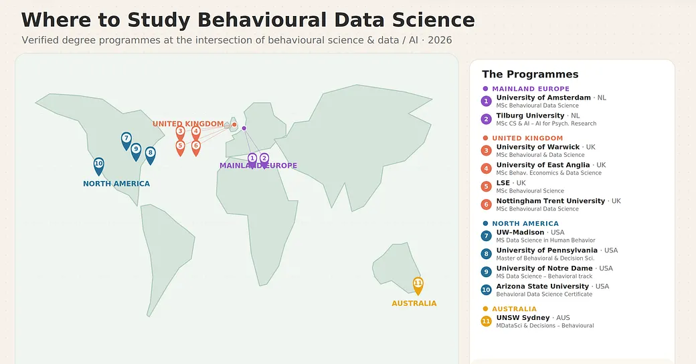

# Awesome Behavioural Data Science & Behavioural AI 

> A curated library of books, papers, degrees, courses, datasets, and tools for **Behavioural Data Science (BDS)** and **Behavioural AI** — the interdisciplinary fields that combine behavioural science and data science to understand, predict, and explain human, algorithmic, and systemic behaviour.

Curated by [Prof. Ganna Pogrebna](https://www.gannapogrebna.com) (University of Sydney Business School; The Alan Turing Institute), co-editor of *The Cambridge Handbook of Behavioural Data Science*. Contributions welcome — see [Contributing](#contributing).

## Contents

- [Start here: the Handbook](#start-here-the-handbook)
- [Books](#books)
- [Foundational papers](#foundational-papers)
- [Behavioural AI & machine behaviour](#behavioural-ai--machine-behaviour)
- [Degrees & university programmes](#degrees--university-programmes)
- [Short courses & certificates](#short-courses--certificates)
- [Research centres & groups](#research-centres--groups)
- [Datasets & tools](#datasets--tools)
- [Ethics & governance](#ethics--governance)
- [Contributing](#contributing)

## Start here: the Handbook

- 📕 **[The Cambridge Handbook of Behavioural Data Science](https://doi.org/10.1017/9781108939010)** — Pogrebna, G. & Hills, T. T. (Eds.), Cambridge University Press, 2026. The field-defining reference: 44 chapters across Human Behaviour, Algorithmic Behaviour, Systems and Culture, and Applications. See the [companion repository](https://github.com/BehaviouralDataScience/cambridge-handbook-behavioural-data-science) for the full chapter guide with video overviews.

## Books

- **The Missing B in AI** — Pogrebna, G. (2025, Behavioural Data Science Press). Why AI products fail when they capture clicks but miss cognition; introduces the Built on Behaviour™ framework — the founding text of Behavioural AI as a design discipline.
- **Big Bad Bias Book** — Pogrebna, G. & Renaud, K. (2025, Behavioural Data Science Press). An accessible illustrated tour of cognitive biases and their consequences in data-driven systems.
- **Behavioral Network Science: Language, Mind, and Society** — Hills, T. T. (2024, Cambridge University Press). How network science explains cognition, language, and collective behaviour.
- **Bit by Bit: Social Research in the Digital Age** — Salganik, M. (2018, Princeton University Press). The essential methods text for studying behaviour with digital trace data; the closest sibling discipline text to BDS.
- **Thinking, Fast and Slow** — Kahneman, D. (2011, FSG). The canonical account of the two-systems view of judgement and decision-making that underpins behavioural science.
- **Nudge (Final Edition)** — Thaler, R. & Sunstein, C. (2021, Penguin). Choice architecture and its policy applications.
- **Behavioral Game Theory** — Camerer, C. (2003, Princeton University Press). Experiments on strategic interaction — how people actually play games.
- **Social Physics** — Pentland, A. (2014, Penguin). Early, influential argument for studying society through big behavioural data.
- **Navigating New Cyber Risks** — Pogrebna, G. & Skilton, M. (2019, Palgrave Macmillan). Behavioural approaches to cybersecurity risk — an applied BDS domain covered in Handbook Ch. 42.

## Foundational papers

- **Prospect Theory: An Analysis of Decision under Risk** — Kahneman, D. & Tversky, A. (1979), *Econometrica*. The most-cited paper in behavioural science; the theory of how people actually choose under risk.
- **Computational Social Science** — Lazer, D. et al. (2009), *Science*. The manifesto that launched large-scale digital study of human behaviour.
- **Psychological targeting as an effective approach to digital mass persuasion** — Matz, S. et al. (2017), *PNAS*. Demonstrated behaviour prediction and influence from digital footprints at scale.
- **Using large-scale experiments and machine learning to discover theories of human decision-making** — Peterson, J. et al. (2021), *Science*. Machine learning as a theory-discovery engine for behavioural science.

## Behavioural AI & machine behaviour

- **Machine Behaviour** — Rahwan, I. et al. (2019), *Nature*. The landmark call to study intelligent machines as a new class of behaving agents — with the methods of behavioural science.
- **Using cognitive psychology to understand GPT-3** — Binz, M. & Schulz, E. (2023), *PNAS*. Running classic behavioural experiments on large language models.
- **The Missing B in AI** — Pogrebna, G. (2025). See [Books](#books); the applied framework for behaviourally intelligent AI systems.
- For LLM conversational behaviour, algorithm aversion/appreciation, and hybrid decision-theory/ML modelling, see Handbook Part III (Chs. 11–18).

## Degrees & university programmes

  

Verified full degree programmes at the intersection of behavioural science and data/AI, as of **July 2026**. Maintained from [Where to Get a Degree in Behavioural Data Science](https://www.gannapogrebna.com) by Ganna Pogrebna — read the full post for guidance on choosing between them (in short: the home department determines the programme's personality — check the module list, the programming on-ramp, and who teaches). *Listing is not endorsement. Fees and intake dates change every year — always verify on the university's own page.*

### Mainland Europe

| Programme | Institution | Notes |
|---|---|---|
| MSc Psychology: Behavioural Data Science | **University of Amsterdam** 🇳🇱 | One of the longest-running dedicated programmes |
| MSc Cognitive Science & AI: AI for Psychological Research track | **Tilburg University** 🇳🇱 | The closest thing on this list to a proper "behavioural AI" degree |

### United Kingdom

| Programme | Institution | Notes |
|---|---|---|
| MSc Behavioural and Data Science | **University of Warwick** 🇬🇧 | The world's first programme in Behavioural Data Science; psychology and computer science jointly taught |
| MSc Behavioural Economics and Data Science | **University of East Anglia** 🇬🇧 | Behavioural economics with a genuine data science spine |
| MSc Behavioural Science | **London School of Economics** 🇬🇧 | Branded "behavioural science" but strongly quantitative, with substantial AI and emerging-tech content |
| MSc Behavioural Data Science | **Nottingham Trent University** 🇬🇧 | Data science with psychology through to neuroscience |

### North America

| Programme | Institution | Notes |
|---|---|---|
| MS Psychology: Data Science in Human Behavior | **University of Wisconsin–Madison** 🇺🇸 | Computational toolkit for behavioural-science graduates |
| Master of Behavioral and Decision Sciences (MBDS) | **University of Pennsylvania** 🇺🇸 | Decision science, behavioural economics, and networks, with emerging-tech components |
| MS in Data Science: Behavioral Data Science track | **University of Notre Dame** 🇺🇸 | Behavioural specialisation inside a full data science master's |
| Behavioral Data Science Graduate Certificate | **Arizona State University** 🇺🇸 | Stackable certificate with a genuine pathway into a larger degree |

### Australia

| Programme | Institution | Notes |
|---|---|---|
| Master of Data Science and Decisions: Behavioural specialisation | **UNSW Sydney** 🇦🇺 | Currently the lone Southern Hemisphere programme |

**One to watch:** UT Austin 🇺🇸 has announced a Behavioral Data Science initiative, including plans for one of the first bachelor's degrees in the field with a master's to follow — not yet enrolling, so not yet on the map.

## Short courses & certificates

*Coming soon — a verified list of certificates, MOOCs, bootcamps, and professional courses in BDS and Behavioural AI. Watch this space or [suggest one](#contributing).*

## Research centres & groups

- **Behavioural Data Science group, The Alan Turing Institute** (UK) — led by Ganna Pogrebna; the UK national institute's home for BDS research.
- *A fuller verified list of labs and institutes (for PhD and research careers) is coming soon.*

## Datasets & tools

*Coming soon — behavioural datasets, experiment platforms, and analysis toolkits. [Suggest one](#contributing).*

## Ethics & governance

- **Weapons of Math Destruction** — O'Neil, C. (2016, Crown). How opaque algorithms encode and amplify behavioural harms.
- **The Age of Surveillance Capitalism** — Zuboff, S. (2019, PublicAffairs). The political economy of behavioural data extraction.
- **The EU Artificial Intelligence Act** — the regulatory frame for behavioural modelling post-2024; see Handbook Chs. 43–44 for pre- and post-AI Act governance of behavioural data science.

## Contributing

This is a living document. Know a degree, course, dataset, paper, or centre that belongs here? Open an issue or a pull request — corrections are as welcome as additions. Entries should be verifiable on an official page and genuinely at the intersection of behavioural science and data science/AI (not just three fashionable words arranged like fridge magnets).

---

Part of the <a href="https://github.com/BehaviouralDataScience">Behavioural Data Science hub</a>, curated by Prof. Ganna Pogrebna, co-editor of <i>The Cambridge Handbook of Behavioural Data Science</i> (Cambridge University Press, 2026) and author of <i>The Missing B in AI</i> (2025).
